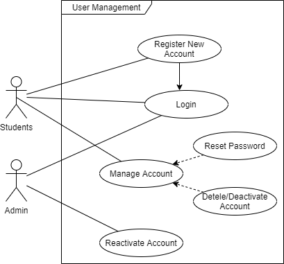
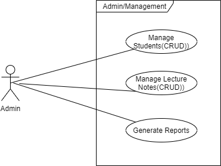
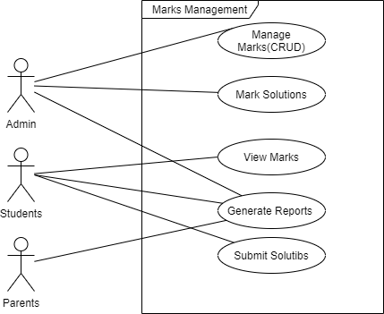

# My Projects 

### Problem Statement

Learners from public schools were unable to adapt to online learning because they were using Whatsapp for learning. 

### Proporsed Solutins 

Is to create an e-learning system that can assign homework or assignments to students based on their grade and subjects, and can share documents more easily. However, it will also allow teachers to upload content, marks, and scrips and generate reports. Parents will also be able to generate reports to track the progress of their children. 

### User Casses for Functional Requirements

#### User Managent

#### Admin Managent

#### Marks Managent

